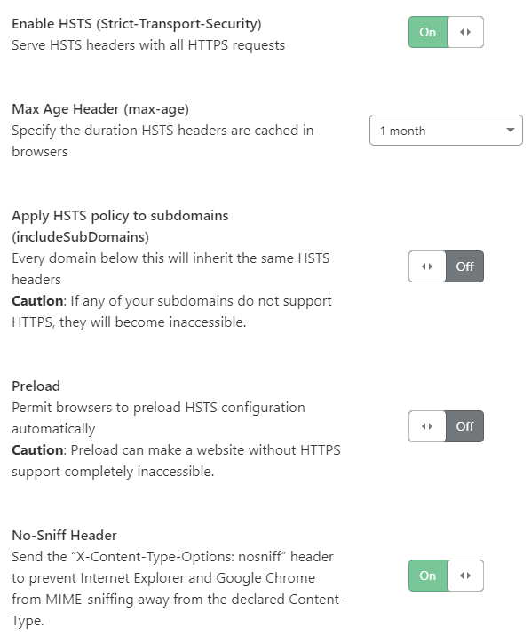
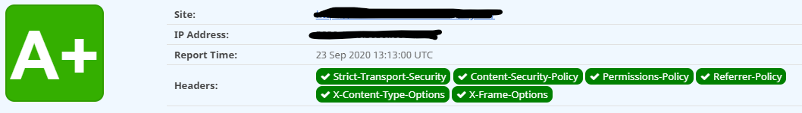
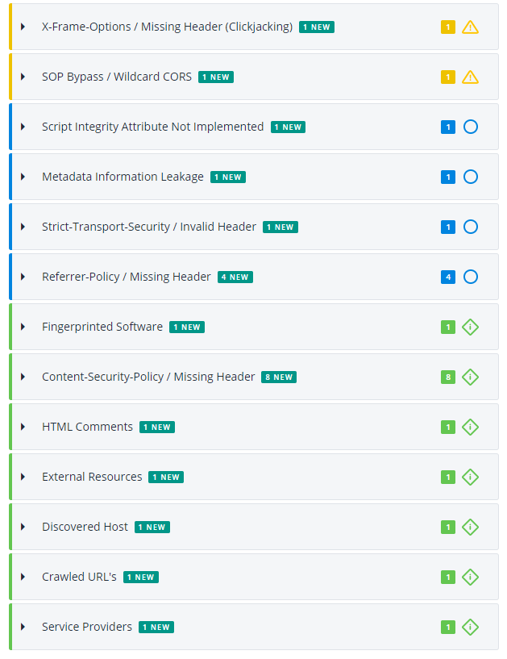

# Front-End Development And Security

A couple of years ago, thousands of websites globally were hijacked by code, which made computers run cryptocurrency mining software.

[Discovered by renowned security-expert Scott Helme](https://scotthelme.co.uk/protect-site-from-cryptojacking-csp-sri/), the malicious code was injected into a 3rd party accessibility-script, “browsealoud” by a company called texthelp.

Among the hijacked sites were most UK government sites, the website of the swedish police, and many more.

There's no doubt about where the crimes of the future will take place, so it's surprising to see, how few websites take security seriously.

And I admit, it's a hard sell: Unlike new, cool UI-components, engaging animations, creative user-journeys etc., security isn't sexy — it's not even visible!

But it will be the day, a security flaw scrapes important data, or otherwise ruins revenue.

Security should be an ongoing strategy for any company, but **who** should maintain it? Some of it is clearly front-end related.

## Front-end Fixes
### node / npm
The first line of defense is fixing frontend-assets. If your site use `node_modules`, test for vulnerabilities by running:  
`$ npm run audit`, optionally with the `--fix` parameter.
The latter will try to fix vulnerabilities, as well as give you a report with further steps to take. Yes, some projects contains 500MB+ of `node_modules`, but it has to be done.

### 3rd party scripts and `integrity`
I have a project where I'm using **unpkg** to deliver a script.   
**unpkg** is a fast, global content delivery network for everything on npm.

```js
<script defer
  src="https://unpkg.com/smoothscroll-polyfill@0.4.4/dist/smoothscroll.min.js">
</script>
```

Now, if **unpkg** gets hacked, my site will get the hacked script.

Luckily, there's an attribute called `integrity`, which we can add to `<script>`-tags. It's a SHA-key, generated from the (unhacked) script-source. If the script is hacked, the key will not match anymore, and the script will *not* load. The hack I mentioned at the beginning of this post could have been prevented, if the affected sites had used the `integrity`-attribute.

For **unpkg**-scripts, append `?meta` to the end of the url:

```html
https://unpkg.com/smoothscroll-polyfill@0.4.4/dist/smoothscroll.min.js?meta
```

 This will return a json-string/object:

```json
{
  "path":"/dist/smoothscroll.min.js",
  "type":"file","
  contentType":"application/javascript",
  "integrity":"sha384-EYn4rWu1DHvYD0sSSSbMEtXQmMl58CFJd897806+RT1jJVYbhuZlZMN6yG9nCyFa",
  "lastModified":"Tue, 26 Mar 2019 18:21:19 GMT",
  "size":3968
}
```

Take the *integrity*-part and add to your `<script>`-tag — and add a `crossorigin`-attribute as well:

```js
<script defer
  src="https://unpkg.com/smoothscroll-polyfill@0.4.4/dist/smoothscroll.min.js"
  integrity="sha384-EYn4rWu1DHvYD0sSSSbMEtXQmMl58CFJd897806+RT1jJVYbhuZlZMN6yG9nCyFa"
  crossorigin="anonymous">
</script>
```

The official name is “Subresource Integrity”, and most of the large CDN's and script-delivery-services support it.  

Documentation is here:
https://w3c.github.io/webappsec-subresource-integrity/

## Content-Security-Policy
Next up is *Content-Security-Policy*, or *CSP* for short. This can either be added as response-headers on the server, or as a `<meta>`-tag in the html. I'm going to focus on the latter here. 

A CSP will tell the webpage from which domains it will allow loading images, fonts, iframes etc. 

```html
<meta http-equiv="Content-Security-Policy" content="
  default-src;
  script-src 'self' unpkg.com;
  style-src 'self' 'unsafe-inline';
  img-src 'self' data:;
  font-src;
  connect-src 'self';
  media-src 'self';
  object-src 'none';
  child-src;
  frame-src;
  form-action;
  base-uri;
  manifest-src 'self';
    ">
```

To allow the script from **unpkg**, I've added `unpkg.com` to the `script-src`-part of the CSP.  

If you try to load a Google Font with the code above, it will fail. You'll have to add entries to both `font-src` and `style-src`. 

For YouTube, you need entries to `child-src` since it's iframe-based, to `script-src` to allow it to runs it's JavaScript **and** to `img-src` as it provides thumbnail images as well. Phew! CSP is not easy, but it's the quickest way to add an extra layer of protection to your site.

> **NOTE!** Marketeers and SEO-people *hate* CSP's!  
With a CSP in place, they can no longer just add a cool new tracking-script via *Google Tag Manager* or similar. So be prepared to hear a lot of complaints, unless you create a CMS-block, where they can add/remove CSP entries themselves.

*Google Chrome* supports many more CSP-entries than listed above. Unfortunately most of these doesn't work in *Apple Safari*, and can actually cause it to *not* parse JavaScript, so be sure to test in all browsers.

More info here:
https://content-security-policy.com/

And to help you create one:
https://report-uri.com/home/generate


## Server Fixes
For the server-fixes, I'm going to use Cloudflare.

Cloudflare has a bunch of services — in their own words:

> Cloudflare secures and ensures the reliability of your external-facing resources such as websites, APIs, and applications. It protects your internal resources such as behind-the-firewall applications, teams, and devices. And it is your platform for developing globally scalable applications.

They have a super-intuitive user-interface - and for most purposes, it's *free!*  

You can find guides on their site on how to move your DNS records etc.

But maybe there's no need for you to use Cloudflare? 

Before I continue, check your security-headers here: https://securityheaders.com/


If you have a red **F**, let's see how we can improve that with Cloudflare.

Now, the first thing to do on *any* server, is adding **SSL** (HTTPS).

In Cloudflare, go to SSL/TLS, select “Edge Certificates” and check the “Always use HTTPS” box.

Just below that, you'll see the “HTTP Strict Transport Security (HSTS)”-entry.

Click on “Change ”, accept the warnings, check “Enable HSTS”, set “Max Age Header” to (minimum) “1 month”, and check “No-Sniff Header”:




Now, go back to https://securityheaders.com/

If you had an **F** before, you should now have a **D**

Cloudflare doesn't support the other headers *out-of-the-box*, but luckily they have something called *Workers*, where you can add them yourself.

Scott Helme has written an excellent article here: https://scotthelme.co.uk/security-headers-cloudflare-worker/

Because the article was written some time ago, you need to manually add the “Permissons-Policy” to Scott's list of “securityHeaders”.

When set and done, deploy the worker, and head back to SecurityHeaders:



Wow! - from **F** to **A+** in a matter of minutes.

## Ongoing maintenance
Now, even if you've done all the things I suggest in this post, you should'nt rest on your laurels. Security is an ongoing activity — you need to test your site whenever a new script is added, update `integrity`-attributes, test SecurityHeaders etc. Whenever a new vulnerability is discovered, test again.

You can also use a service like Detectify: https://detectify.com/

Detectify will deep-scan your site and provide a “todo-list” of things, you potentially need to look into:



They will continuously monitor your site for security vulnerabilities, starting from USD 50 per month per domain. 

## Conclusion

The world of front-end is contantly expanding. It used to be simple enough to define our vocation: HTML, CSS and JavaScript — but does that include animation, email development, accessibility, SEO, tracking, performance engineering or ... security?

I'd argue that it doesn't hurt to know *a bit* about XSS attacks, Content Security Policy-configuration, or that SVG files can contain (harmful) scripts — but we would probably need a specific role for that, as it's a big and complex topic. 

Every website should have a “Security Health-check” at least a couple of times per year. Wheher or not it will be a front-end-job ... time will tell.