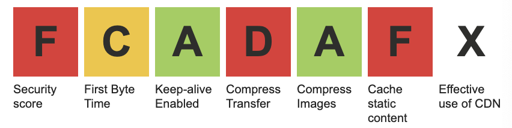

# High Performant Websites

Optimize CSS, look into Layers/paint
will-change
transform: translateZ(0)



```html

<iframe loading="lazy>
```
React and Vue-issues with native lazy-loading


```html
<video preload="none">
```

`playsinline` or `auturun`

Custom lazy-load
Test if server supports `accept-ranges: bytes` and response code 206
 
 `srcset` and `sizes` optimization (another post)

 Dual builds:

 ```html
 <script type="module"></script>
 <script nomodule></script>
```


Preload
Defer / Async
Layout Shifts


On Cloudflare, `json`-files and `mjs`are not cached for more than 10 minutes.
Page Rules

Why HTTP/1 is slow
HTTP/2 enabled by default for free account
HTTP/3 (with QUIC)
Speed Tab:
Auto Minify
Brotli


Rocket Loader ?

When deploying, purge Cloudflare Cache

Image Resizing > Upgrade to Business

HTTP/1 on Mac because of AVG

