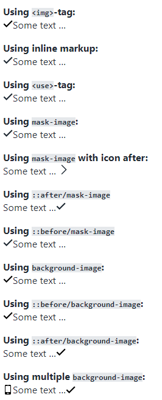

# Iconic icons

I don't think I was WIMPy as a kid, but I use WIMP (**W**indow **I**con **M**enu **P**ointing-device) everyday — and icons are a **huge** part of any _graphical user interface_.

Icons can either be _informative_ — like icons next to form fields, providing additional visual clues — or _actionable_, like the infamous “hamburger”-icon, triggering a mobile navigation.

---

## User experience
The Nielsen Norman Group[^1] summarises the use of icons like this:

> A user’s understanding of an icon is based on previous experience. Due to the absence of a standard usage for most icons, text labels are necessary to communicate the meaning and reduce ambiguity.

Designers will most likely disagree with this, since they often use icons to _save_ space, thus ditching the text labels, and relying on the user recognizing the [meaning of the] icon.
So, designers — _if possible_ — please use icons in conjunction with a descriptive text that's crisp and clear.

---

## Implementations
There are _many_ ways of implementing icons.  
Nowadays, **avoid bitmap formats like PNG or JPG**, since these are not crisp and _scalable_.  
Instead, use _Scalable Vector Graphics_: `<svg>`.

An `<svg>` can either be:

- A physical file, you can reference as:
  - The `src` of an ``-tag in HTML
  - The `xlink:href`-attribute of a `<use>`-tag in HTML
  - The `url` of a `background-image` in CSS
  - The `url` of a `mask-image` in CSS
  - The `data`-attribute of an `<object>`-tag (don't)
  - The `src`-attribute of an `<iframe>`-tag  (don't)

- Inline markup, that you can use:
  - Directly in HTML
  - As an encoded string in CSS, which can then be used as:
    - `background-image`
    - `content` in a pseudo-element
    - `mask-image`

> **Note:** Your `<svg>`-files should be as _neutral_ as possible, so they can be used in multiple scenarios.  
Remove attributes such as `stroke` and `fill` — these will be applied through CSS.

Let's look at the various options:

---

### The least flexible: In an `` tag
You should already know this:

```html

```

This works fine — you can control the size from CSS, but that's about it.  
`fill` and `stroke` will have to be hardcoded in the svg-file — not very flexible.

---

### The most flexible: inline markup
If you want _full control_, the best way to add an `<svg>`-icon, is to inline it in your HTML-markup, like this:

```xml
<svg viewBox="0 0 16 16" class="c-ico">
  <path d="M14 2.5l-8.5 8.5-3.5-3.5-1.5 1.5 5 5 10-10z"></path>
</svg>
```

You can style it in CSS, like in this example:

```css
.c-ico {
  fill: tomato;
  height: 1em;
  width: 1em;
}
```

— But you can also add _CSS classes_ to individual SVG elements:

```xml
<path d="..." class="c-ico--custom" />
```

— And you can use all the usual CSS-tricks:

```css
.c-ico:hover {
  fill: darkred;
  transform: scale(2);
}
```

---

### Still flexible: Spritemap using `<use>` and `<symbol>`

If you're going to use the icon in many places though, a more practical solution is a _spritemap_, using `<use>` and `<symbol>`.

You don't have full control, as when using _inline_, but it's good enough for most icon-use-cases.

You basically move all your `<svg>`-icons to one central _spritemap.svg_-file, and link to them, using `<use>`.

Change the `<svg>`-tag to `<symbol>`, add an `id`-attribute with a unique value, and place it in the `<defs>`-section as in the example below:

```xml
<svg aria-hidden="true"
  style="position: absolute; width: 0; height: 0; overflow: hidden"
  xmlns="http://www.w3.org/2000/svg"
  xmlns:xlink="http://www.w3.org/1999/xlink">
  <defs>

    <symbol id="icon-check" viewBox="0 0 16 16">
      <path d="M14 2.5l-8.5 8.5-3.5-3.5-1.5 1.5 5 5 10-10z"></path>
    </symbol>

    <symbol id="icon-search" viewBox="0 0 16 16">
     ... etc.
    </symbol>

  </defs>
</svg>
```

Then, to use it:

```xml
<svg class="c-ico">
  <use xlink:href="../assets/svg/spritemap.svg#icon-check" />
</svg>
```

Where `xlink:href` is the path and name of the SVG-file, and the `#fragment`-indetifier is the `id` of the `<symbol>` you want to use.

---

### As an encoded string in CSS
It is also possible to store an `<svg>` directly as an encoded string in CSS.  
You might have seen examples of an `<svg>`, encoded with `base64`:

```css
background-image: url('data:image/svg+xml;base64,PD94bWwgdmVyc2lvbj0iMS4wIiBlbmNvZG ...
```

It comes at a price[^2], though:

> It takes 4 characters per 3 bytes of data, plus potentially a bit of padding at the end.

A better and more readable way, is to `utf-8`-encode it, allowing you to basically “dump” a regular `<svg>` with line-breaks and spaces removed.  

Since `utf-8` is the default encoding, it's not even nessecary to specify it:

```css
background-image: url('data:image/svg+xml,<svg xmlns="http://www.w3.org/2000/svg" viewBox="0 0 16 16"><path d="M14 2.5l-8.5 8.5-3.5-3.5-1.5 1.5 5 5 10-10z"></path></svg>');
```

If you want it more readable, escape each line with a backslash: `\`

The disadvantage of storing the encoded `<svg>` directly as a `background-image`, `mask-image` or `content`-property is duplication. You need to “dump” the `<svg>` for each use. A much smarter way is to store all your most used icons as _CSS Custom Properties:_

```css
--i-check: url('data:image/svg+xml,<svg xmlns="http://www.w3.org/2000/svg" viewBox="0 0 16 16"><path d="M14 2.5l-8.5 8.5-3.5-3.5-1.5 1.5 5 5 10-10z"></path></svg>');
```

This way, you can re-use the `<svg>`-data in as many places as you want:

```css

.c-ico--check {
  background-image: var(--i-check);
}
.c-ico--checkmask {
  mask-image: var(--i-check);
}
.selector::before {
  content: var(--i-check);
}
```

You can also _dynamically_ change an icon by using this method with `background-image`.  
Consider this example:

```css
.c-ico__bgi {
  /* excerpt */
  --ico-bgi: var(--i-empty);
  background-image: var(--ico-bgi);
}
```

It creates a `background-image`, which by default is set to an empty `<svg>`. 

Change the icon with a modifier-class:

```css
.c-ico--check {
  --ico-bgi: var(--i-check);
}
```

No new CSS required — just an update of a variable.

---

## Coloring an `<svg>`-icon

All of the `<svg>` presentation attributes[^3] can be used as CSS properties, so if you're inlining your `<svg>`, you have all presentation options either as `attributes` in the markup, or as `properties` in CSS.  
Just remember, that `background-color` is called `fill` in `<svg>`!

```css
.custom-svg {
  fill: red;
  stroke: green;
  stroke-width: 3px;
}
```

> **Note:** In `<svg>`, the value of the `stroke-width`-attribute is _relative_ to the `viewBox`.  
In CSS, use a unit, like `px` or `em` etc.

---

### Duo-tone
You can style attributes like `stroke` and `fill` from CSS, but if you're using a _spritemap_, all the `<svg>`-icons (or: the elements within them, like `path` or `line`) will have the same styling.  

Maybe that's what you want, but there's one extra option:

`currentColor` is a reserved CSS-keyword (value), inheriting the current color (following the cascade). If you have an icon with more than one element and want some of the elements to have a different `stroke` or `fill`, do this:

```xml
  <line x1="25" y1="25" x2="75" y2="75" />
  <line x1="75" y1="25" x2="25" y2="75" stroke="currentColor />
```

And in the CSS:

```css
.c-ico {
  color: red;
  stroke: tomato;
}
```

The first `line`-element will use the `stroke`-property, the second one will use the `color`-property.  

---

### Coloring a `background-image`. 

It is also possible to color[^4] an `<svg>` as a `background-image` — but it ain't pretty!  
You need to set an initial `fill`-value in either the physical `<svg>`-file or in the CSS Custom property — and you need to set it to one of the allowed values for: **white** (`#FFF`, `white` etc).  

In `hsl`, the value for “white” is: `hsl(0, 0%, 100%)`, so that's the _starting point_. You could also use 'black' as your starting point, but for these examples it's “white”.

Now, you can use a CSS filter to _change_ the `hue`, `saturation` or `lightness` from the _starting point_ of  `hsl(0, 0%, 100%)`, for example:

```css
.c-ico--pink {
  filter: brightness(0.5) sepia(1) hue-rotate(-70deg) saturate(5);
}

.c-ico--blue {
  filter: brightness(0.5) sepia(1) hue-rotate(140deg) saturate(6);
}
```

---

### Coloring a `mask-image`

It's much easier to color a `mask-image` — and if you store your icons as _CSS Custom Properties_ as mentioned above, you have a very flexible combination.

Place an `<svg>` as the `url()` of a `mask-image`-property on an element that also has  a `background-color`.  

The `<svg>` will be “masked” with that color: 

```css
.c-ico__mai {
  /* excerpt */
  --ico-bgc: currentColor;
  --ico-h: 1em;
  --ico-mai: var(--i-empty);
  --ico-w: 1em;

  background-color: var(--ico-bgc);
  height: var(--ico-h);
  mask: no-repeat center/var(--ico-w) var(--ico-mai);
  width: var(--ico-w);
}
```

It's super-easy to change the icon _and_ it's color with a modifier-class:

```css
.c-ico--check {
  --ico-bgc: tomato;
  --ico-mai: var(--i-check);
}
```

As the icon here has it's own element (`<i>` in this example):


```html
<i class="c-ico__mai c-ico--check" aria-hidden="true"></i>
```

— all the usual CSS-tricks can be applied as well: `transform`, for example.

---

## Usage Examples

In the examples below, I've visualized why `inline svg`, `<use>` or `mask-image` are my preferred methods when implementing `<svg>`-icons (the “checkmark” in the examples).

If you change the text-color, as in the “dark mode” -example, the `<svg>`'s used as `` or `background-image` will not change color.

prefers-color-scheme: light         |  prefers-color-scheme: dark
:--------------------------         |:---------------------------
 | 


See this example at [elements.stoumann.dk/icon](https://elements.stoumann.dk/icon/).

See examples of icons in `<button>`'s at [elements.stoumann.dk/button](https://elements.stoumann.dk/button/).

See examples of icons in links at [elements.stoumann.dk/link](https://elements.stoumann.dk/link/).

---

## Security and `<svg>`

> [...] Because of this ability to contain JavaScript, they are a perfect attack vector for Cross-Site Scripting on sites which allow either arbitrary file uploads or limit the file types to images and accept SVGs

The quote above is from a blog-post entitled Protecting against XSS in SVG[^6], outlining the security issues related to using `<svg>`.

`<svg>` is `<xml>`, and thus it can contain a regular `<script>`-block.  
If you have an _Icon System_ that automatically inlines `<svg>`'s in your final markup, thread carefully, if content-editors are allowed to upload `<svg>`'s directly.

_Example:_

```xml
<svg viewBox="0 0 100 100" class="c-ico--stroke">
  <path d="M25,25 L75,75 M75,25 L25,75"></path>
  <script>console.log('Evil script running...');</script>
</svg>
```

When inlined, the script will run, check the `console`.
In newer browsers, scripts will not run if the `<svg>` is used from either ``-tags or via `<use>`.

---

## Optimising `<svg>`: An example

When you receive an `<svg>` from a designer, it usually contains _way too much_ unnecesssary clutter.  
Here's a real-life example of a simple "close icon", I received from a designer:


And it's markup:

```xml
<svg xmlns="http://www.w3.org/2000/svg" xmlns:xlink="http://www.w3.org/1999/xlink" width="12px" height="12px" viewBox="0 0 12 12" version="1.1">
    <!-- Generator: sketchtool 53.2 (72643) - https://sketchapp.com -->
    <title>A4C03F22-E034-4E98-A360-BB2DF63FB138</title>
    <desc>Created with sketchtool.</desc>
    <g id="Style" stroke="none" stroke-width="1" fill="none" fill-rule="evenodd">
        <g id="Icons" transform="translate(-521.000000, -281.000000)" fill="#6C6F70">
            <g id="Stacked-Group" transform="translate(248.000000, 273.000000)">
                <path d="M280.481608,14.0014021 L284.709147,9.77838915 C285.099578,9.36728524 285.099578,8.72103629 284.693145,8.29553574 C284.278712,7.90042809 283.614659,7.90042809 283.216227,8.30193425 L278.999889,12.5201483 L274.783551,8.30193425 C274.386719,7.90202772 273.722666,7.89722884 273.290631,8.30993238 C272.9018,8.72263591 272.9018,9.36728524 273.298632,9.78638728 L277.51817,14.0014021 L273.298632,18.2228154 C272.9018,18.6211223 272.9018,19.2929653 273.298632,19.6928718 C273.500248,19.8928251 273.756268,20 274.041091,20 C274.348316,20 274.609137,19.8880262 274.783551,19.6928718 L278.999889,15.4810562 L283.203426,19.6784752 C283.393841,19.8880262 283.654662,20 283.958686,20 C284.245109,20 284.50113,19.8928251 284.701146,19.6928718 C285.099578,19.2945649 285.099578,18.6195227 284.701146,18.2212158 L280.481608,14.0014021 Z" id="close"/>
            </g>
        </g>
    </g>
</svg>
```

By using Jake Archibald's SVGOMG-tool[^5], a lot of the unnecesarry bits can be cut off:

```xml
<svg xmlns="http://www.w3.org/2000/svg" width="12" height="12">
  <path fill="#6C6F70" fill-rule="evenodd" d="M7.482 6.001l4.227-4.223a1.07 1.07 0 0 0-.016-1.482 1.062 1.062 0 0 0-1.477.006L6 4.52 1.784.302C1.387-.098.723-.103.29.31a1.072 1.072 0 0 0 .008 1.476l4.22 4.215-4.22 4.222a1.056 1.056 0 0 0 0 1.47c.201.2.457.307.742.307.307 0 .568-.112.743-.307L6 7.48l4.203 4.197a.99.99 0 0 0 .756.322c.286 0 .542-.107.742-.307a1.055 1.055 0 0 0 0-1.472l-4.22-4.22z"/>
</svg>
```

The file went from 1571 bytes to 473 bytes.  
But, for such a simple icon, we can also _handcode_ it with two `line` elements:

```xml
<svg xmlns="http://www.w3.org/2000/svg" viewBox="0 0 100 100">
  <line x1="25" y1="25" x2="75" y2="75" stroke="#6C6F70" />
  <line x1="75" y1="25" x2="25" y2="75" stroke="#6C6F70" />
</svg>
```

Or, using `path`:

```xml
<svg xmlns="http://www.w3.org/2000/svg" viewBox="0 0 100 100">
  <path d="M25,25 L75,75 M75,25 L25,75" stroke="#6C6F70" />
</svg>
```

Notice, that I changed `width` and `height` to `viewBox`, which creates a "real coordinate system" and will allow us to easier control responsiveness. Instead of `fill`, I used `stroke`.

If the `<svg>` is going to be used *inline* or in an *spritemap* using `symbol` , we can also remove the `xmlns`-attribute and style-declarations (`stroke`, `fill` etc.):

```xml
<svg viewBox="0 0 100 100">
  <path d="M25,25 L75,75 M75,25 L25,75" />
</svg>
```

That's **77 bytes**, approx. **5%** of the original file-size.

To optimize `<svg>`'s automatically during a _build process_, read on.

---

## SvgSpritemapWebpackPlugin

> This webpack plugin generates a single SVG spritemap containing multiple <symbol> elements from all .svg files in a directory. In addition, it can optimize the output and can also generate a stylesheet containing the sprites to be used directly from CSS. 

Download SvgSpritemapWebpackPlugin[^7] if you're looking for an easy way to convert a folder of `.svg`-files to a single _spritemap_. While the current version cannot generate _CSS Custom Properties_ from the `.svg`-files, there are `.scss` and `.less` mixin/variables that will let you use them from CSS.

_Example for scss:_
```css
.example {
  /* Using the included sprite() mixin */
  @include sprite('check');

  /* Using the SVG from the map directly */
  background-image: url(map-get($sprites, 'check'));
}
```

_SvgSpritemapWebpackPlugin_ can also run **svgo** and **svg4everybody** automatically, check out the official documentation.

---

## Polyfill for using `<use>`


IE 11 doesn't support `<use>`, so you'll need a polyfill.

svg4everybody[^8] is a popular polyfill for using `<use>` in _Internet Explorer_, and is highly recommended.

Below is a simple example of conditionally loading _svg4everybody_, if the browser is IE11:

```js
const isIE11 = !!window.MSInputMethodContext && !!document.documentMode;

if (isIE11) {
  const s4e = document.createElement('script');
  const s4eUrl = 'svg4everybody.min.js'
  s4e.setAttribute('src', s4eUrl);
  s4e.onload = function() { svg4everybody(); }
  document.head.appendChild(s4e);
}
```

Download the script from _svg4everybody_'s GitHub-repo, and replace _s4eUrl_ with the correct path.

Or link to it directly from Cloudflare[^9] or a similar CDN-service.

While _svg4everybody_ works in most cases, I had a project where `<text>`-elements were being added dynamically to an `<svg>`-shape, so edtors could modify text-lines in an `<svg>`-shape from a CMS:

```xml
<svg viewBox="0 0 100 100">
  <use xlink:href="file.svg#name" />
  Dynamic <text>content</text> here ...
</svg>
```

_svg4everybody_ replaces `<use>` with the actual `<symbol>`-content, but it does that as the _last child_ of the parent:

```xml
<svg viewBox="0 0 100 100">
  <text>...dynamic content</text>
  Injected content here...
</svg>
```

Thus the `<svg>`-shape ended up _on top_ of the `<text>`-lines.

As the project was already running Babel, I could write a polyfill in ES6:

```js
/**
 * @function svgUse
 * @description Looks up <symbol> in external <svg>, adds content of <symbol> to local <svg>
 * @param {Node} scope
 */
export function svgUse(scope = document) {
  const use = scope.querySelectorAll('use');
  if (use) {
    let symbols = {};
    let svgs = {};

    /* Build Set of unique url's */
    const urls = [];
    use.forEach(elm => {
      const url = elm.getAttribute("xlink:href").split('#')[0];
      if (url && urls.indexOf(url) === -1) {
        urls.push(url);
      }
    });

    /* Fetch all unique URL's, push to
    svgs-object with the url as key */
    Promise.all(urls.map(async url => {
      const data = await fetch(url);
      const text = await data.text();
      svgs[`"${url}"`] = text;
    })).then(() => {

      /* Process each <use>-element, lookup content in `svgs` */
      use.forEach(elm => {
        const [url, id] = elm.getAttribute("xlink:href").split('#');
        const exists = symbols.hasOwnProperty(id);
        /* Check if `id` is already created as a (data)-
        fragment in `symbols`, set fragment */
        let fragment = exists ? symbols[id].data : document.createDocumentFragment();
        /* If `id` does not exist, look it up in svgs using `url`, 
        parse it and extract childNodes */
        if (!exists) {
          const parser = new DOMParser;
          const doc = parser.parseFromString(svgs[`"${url}"`], 'text/xml');
          const svg = doc.getElementById(id);
          Array.from(svg.childNodes).forEach(node => {return fragment.appendChild(node)});
          /* Push fragment and viewBox to `symbols` */
          symbols[id] = { data: fragment, viewBox : svg.getAttribute('viewBox') };
        }
        /* If parent-<svg> does not have a viewBox-
        attribute, add it from <symbol> */
        if (!elm.parentNode.hasAttribute("viewBox")) {
          elm.parentNode.setAttribute('viewBox', symbols[id].viewBox);
        }
        elm.parentNode.replaceChild(fragment.cloneNode(true), elm);
      })
    }).catch(function(err) {
      console.error(err);
    });
  }
```
---

## … but what about Icon Fonts?

I think we've all encountered a slow-loading website, where strange letters or symbols were shown instead of an icon — until the _Icon Font_ finished loading.

That's just _one_ of the downsides of using an _Icon font_.

In the blog-post “It's 2019! Let's End The Debate On Iconm Fonts vs SVG Icons”[^10], `<svg>` is the clear winner when it comes to:

- **Accessibility**. An `<svg>` is treated like an image, not as text, that will be read aloud by a screen-reader.

- **Scalability**. This is the main reason why I switched to using `<svg>`. Also, they're easier to modify _on-the-fly_.

- **Animation**. You can animate each `path`, `line` etc. in an `<svg>`

Google provides an _Icon font_ for their Material Design[^11], so the format is not completely dead — yet.

[^1]: https://www.nngroup.com/articles/icon-usability
[^2]: https://stackoverflow.com/questions/201479/what-is-base-64-encoding-used-for
[^3]: https://css-tricks.com/svg-properties-and-css/
[^4]: https://css-tricks.com/solved-with-css-colorizing-svg-backgrounds/
[^5]: https://jakearchibald.github.io/svgomg/
[^6]: https://digi.ninja/blog/svg_xss.php
[^7]: https://github.com/cascornelissen/svg-spritemap-webpack-plugin
[^8]: https://github.com/jonathantneal/svg4everybody
[^9]: https://cdnjs.cloudflare.com/ajax/libs/svg4everybody/2.1.9/svg4everybody.min.js
[^10]: https://www.lambdatest.com/blog/its-2019-lets-end-the-debate-on-icon-fonts-vs-svg-icons/
[^11]: https://google.github.io/material-design-icons/