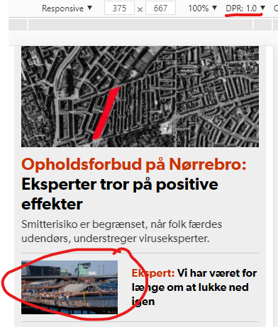
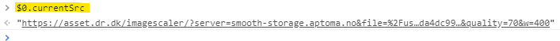

# `<picture>` this: Responsive images are tricky

On a recent project, a content-editor asked me:  
— “Why can't I change the image [for a block/article] for a given beakpoint?” 

And I replied:  
— “Oh, but we *do* already scale the images server-side, and send different resolutions to the client!“

And she said:  
— “No, I want to change to a *completely* different image!”  

Later, a designer on the same project asked me:  
— “Can I change the image [for a block/article], if the user has ‘dark mode’?”

And I replied:  
— “Ha ha! And you probably *also* want to change that image to a *completely* different image for a given breakpoint? *And* server-side-scale all the images in-between?” 

To which he replied:  
— “Yes, of course!”

---

So this is what the clients want — or at least what *that* client wants.  
Is it doable? Yes, but not in an easy, CMS-editor-friendly way.

But before we go there, let's look at the standard way to do *responsive images*, with a server-side scaler, using either the ``-tag standalone, or within the `<picture>`-tag.

## Responsive images


I haven't seen a site that does responsive images correctly, or great — or just *good*.  
And that, unfortunately, includes most of the projects I've been working on myself. 

Why is that?

Short answer: It's difficult!

---

## Use-case: dr.dk
The national television in Denmark, dr.dk, use the `<picture>`-tag with multiple `<source>`-tags for the media-queries and logic.

With a *device-pixel-ratio* set to 1 (DPR), let's focus on the image circled in red:



Select the image in "Elements", then in the `console`, type:

`$0.currentSrc`



That's correct: the screen-width is close to 400, so the image returned by the server-side-scaler is 400 ... but ... The image is not *shown* as `400px`,  `100%` or `100vw` wide. In fact, it's shown as only `136px`. 

Try changing the *DPR* to 2 and refresh the page. 

The image is now loading as `800px`, but only shown as `136 * 2 = 272px`

Where's the `sizes`-attribute - and logic, that will add `w=200` to the scaler, when the image only use half of the allocated width?

When used on a desktop larger than `720px`, this media query is used:
```html 
<source media="(min-width: 720px)" sizes="650px" srcset="">
```

Here, we *do* have the `sizes`-attribute, but used in a way, so it *always* returns the `650px` image (`43.7kb`).  
Even when the browser-width is `1920px`, the image is shown as `280px` (which, using their own image-sizer, is `13kb`), so the issues remain, as the image is 3.36 times larger than it need to be.

> Side note: Can we expect an editor to *know* the image-widths for a content-block, when they create it? I'd say “No”. This should be defined in the grid/content-block-setup by devs. So if an editor drags "block X" into area "Y", devs should know how to display that image.


Now, change the resolution to `1200*1024` and refresh. Yes, you guessed it, it now downloads an image that is `1300px` wide, but displaying it at `280px` (times 2, because of DPR 2). 


---

## Testing
In Chrome, open up *Dev Tools*, and open the device toolbar: `CTRL/CMD+Shift+m`


## Further reading
[^1] https://developer.mozilla.org/en-US/docs/Learn/HTML/Multimedia_and_embedding/Responsive_images

[^2] https://www.smashingmagazine.com/2014/05/responsive-images-done-right-guide-picture-srcset/

[^3] https://medium.com/@elad/a-complete-guide-for-responsive-images-b13db359c6c7