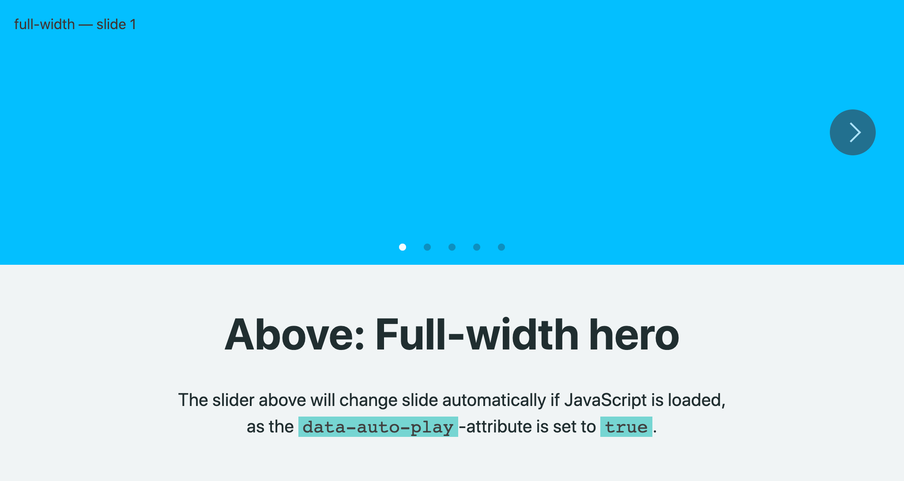

# Layout Block: Recipes

## Full-Width Hero Banner


```html
<section class="c-lay"
  data-align="stretch"
  data-auto-play="5000"
  data-desc-w="s"	
  data-gap-phone="column edge"
  data-gap-tablet="column edge"
  data-gap-desktop="column edge"
  data-grid-phone="100"
  data-grid-tablet="100"
  data-grid-desktop="100"
  data-inner-maw="xl"
  data-nav="arrows dots inside"
  data-outer-maw="xl"
  data-section-type="slider">
```

---
## Preview Slider


```html
<section class="c-lay"
  data-align="stretch"
  data-desc-w="m"	
  data-grid-phone="100"
  data-grid-tablet="100"
  data-grid-desktop="100"
  data-nav="arrows dots"
  data-mb="1x"
  data-preview="next"
  data-section-type="slider">
```

---
## Slider, Multiple Items, No Preview


```html
<section class="c-lay"
  data-align="stretch"
  data-desc-w="s"	
  data-gap-phone="edge"
  data-grid-phone="100"
  data-grid-tablet="50:50"
  data-grid-desktop="33:33:33"
  data-headline-w="m"
  data-nav="arrows scroll"
  data-pb="1x"
  data-preview="next-phone"
  data-section-type="slider">
```

---
## Stacked Section, with Layout Changes


```html
<section class="c-lay"
  data-align="stretch"
  data-desc-w="m"	
  data-grid-phone="50:50"
  data-grid-tablet="33:66"
  data-grid-desktop="25:25:25:25"
  data-headline-w="s"
  data-section-type="stack">
```

---
## Stacked Section, with Layout Changes


```html
<section class="c-lay"
  data-align="stretch"
  data-grid-phone="50:50"
  data-grid-tablet="33:33:33"
  data-grid-desktop="25:50:25"
  data-section-type="stack">
```
---
## Slider with Preview and Layout Toggle
This type also has:
1. Animations
2. Full page-preview when clicked (from `data-item-type="page"`)
3. Theming (from `data-theme="theme02"`)


```html
<section class="c-lay"
  data-align="stretch"
  data-animation="a-fade-in-bottom"
  data-animation-target=".c-lay__item"
  data-grid-phone="50:50"
  data-grid-tablet="33:33:33"
  data-grid-desktop="25:25:25:25"
  data-header-type="row"
  data-item-type="page"
  data-nav="arrows scroll"
  data-pb="1x"
  data-preview="next"
  data-section-type="slider"
  data-theme="theme02"
  data-toggle-layout="stack">
```

---
## Slider with Preview, Layout Toggle, Theme, Scrollbar
This type also has:
1. Animations, targetting the items
2. Animation-delay


```html
<section class="c-lay"
data-align="stretch"
  data-animation="a-scale-in-center"
  data-animation-delay="400"
  data-animation-target=".c-lay__item"
  data-grid-phone="100"
  data-grid-tablet="25:25:25:25"
  data-grid-desktop="25:25:25:25"
  data-header-type="row"
  data-headline-w="m"
  data-nav="arrows scroll"
  data-pb="1x"
  data-preview="next"
  data-section-type="slider"
  data-theme="theme02"
  data-toggle-layout="stack">
```

---
## Slider, similar to previous, Dots below


```html
<section class="c-lay"
  data-align="stretch"
  data-animation="a-fade-in-bottom"
  data-animation-target=".c-lay__item"
  data-desc-w="m"
  data-grid-phone="100"
  data-grid-tablet="100"
  data-grid-desktop="100"
  data-header-type="row"
  data-headline-w="m"
  data-mb="1x"
  data-nav="arrows dots scroll"
  data-preview="next"
  data-section-type="slider"
  data-theme="theme02"
  data-toggle-layout="stack">
```

---
## Diagonal Breaker Section


```html
<section class="c-lay"
  data-align="stretch"	
  data-desc-w="s"
  data-diagonal="small header"
  data-grid-phone="100"
  data-grid-tablet="50:50"
  data-grid-desktop="25:25:25:25"
  data-headline-w="s"
  data-mt="3x"
  data-outer-maw="m"
  data-section-type="stack"
  data-theme="theme04">
```

---
## Diagonal Breaker Section with Content


```html
<section class="c-lay"
  data-align="stretch"
  data-desc-w="m"
  data-diagonal="small header"
  data-grid-phone="100"
  data-grid-tablet="50:50"
  data-grid-desktop="25:25:25:25"
  data-headline-w="m"
  data-outer-maw="xl"
  data-section-type="stack"
  data-theme="theme03">
```

---
## Slider, with Preview of Next and Previous


```html
<section class="c-lay"
  data-align="stretch"	
  data-animation="a-fade-in-bl"
  data-grid-phone="100"
  data-grid-tablet="33:33:33"
  data-grid-desktop="33:33:33"
  data-headline-w="m"
  data-mb="1x"
  data-nav="arrows scroll"
  data-preview="both"
  data-section-type="slider">
```

---
## Expand / Collapse Section


```html
<section class="c-lay"
  data-align="stretch"	
  data-animation="a-fade-in-bottom"
  data-collapsed-height="small"
  data-desc-w="m"
  data-expanded="false"
  data-grid-phone="100"
  data-grid-tablet="66:33"
  data-grid-desktop="66:33"
  data-headline-w="m"
  data-mb="1x"
  data-section-type="stack"
  data-theme="theme01">
```

---
## Slider with Continuos Loop


```html
<section class="c-lay"
  data-align="stretch"
  data-grid-phone="100"
  data-grid-tablet="50:50"
  data-grid-desktop="33:33:33"
  data-loop="true"
  data-nav="arrows scroll"
  data-pb="1x"
  data-section-type="slider"
  data-theme="theme03">
```

---
## Stacked, No Gap between Columns


```html
<section class="c-lay"
  data-align="stretch"
  data-animation="a-fade-in-bl"
  data-gap-phone="column"
  data-gap-tablet="column"
  data-gap-desktop="column"
  data-grid-phone="100"
  data-grid-tablet="50:50"
  data-grid-desktop="50:50"
  data-headline-w="m"
  data-mb="1x"
  data-section-type="stack"
  data-snap="true"
  data-theme="theme04">
```

---
## Stacked, No Gap between Rows


```html
<section class="c-lay"
  data-align="stretch"	
  data-animation="a-fade-in-bl"
  data-gap-phone="row"
  data-gap-tablet="row"
  data-gap-desktop="row"
  data-grid-phone="100"
  data-grid-tablet="50:50"
  data-grid-desktop="50:50"
  data-headline-w="m"
  data-mb="1x"
  data-section-type="stack">
```

---
## Stacked, No Gap between Columns and Rows


```html
<section class="c-lay"
  data-align="stretch"
  data-animation="a-fade-in-bl"
  data-gap-phone="column row"
  data-gap-tablet="column row"
  data-gap-desktop="column row"
  data-grid-phone="100"
  data-grid-tablet="50:50"
  data-grid-desktop="50:50"
  data-headline-w="m"
  data-mb="1x"
  data-section-type="stack">
```

---
## Masonry


```html
<section class="c-lay"
  data-grid-phone="50:50"
  data-grid-tablet="33:33:33"
  data-grid-desktop="25:25:25:25"
  data-section-type="masonry">
```

---
## Grid Gallery


```html
<section class="c-lay"
  data-gap-phone="edge small"
  data-gap-tablet="edge small"
  data-gap-desktop="small"
  data-grid-phone="100"
  data-grid-tablet="100"
  data-grid-desktop="100"
  data-inner-pb="0x"
  data-item-type="image"
  data-nav="arrows dots"
  data-inner-maw="l"
  data-outer-maw="xl"
  data-section-type="grid-gallery">
```

---
## Ebook / Horizontal Article


```html
<section class="c-lay"
  data-align="start"
  data-grid-phone="100"
  data-grid-tablet="100"
  data-grid-desktop="100"
  data-inner-maw="s"
  data-item-type="ebook"
  data-nav="arrows scroll"
  data-pb="1x"
  data-preview="next"
  data-section-type="stack">
```

---
## Storytelling


```html
<section class="c-lay"
  data-align="stretch"	
  data-desc-w="m"
  data-headline-w="s"
  data-item-type="story"
  data-outer-maw="m"
  data-section-type="stack">
```

---
## Slider Tabs


```html
<section class="c-lay"
  data-align="stretch"
  data-grid-phone="100"
  data-grid-tablet="100"
  data-grid-desktop="100"
  data-inner-maw="l"
  data-nav="dots tabs"
  data-outer-maw="xl"
  data-section-type="slider">
```